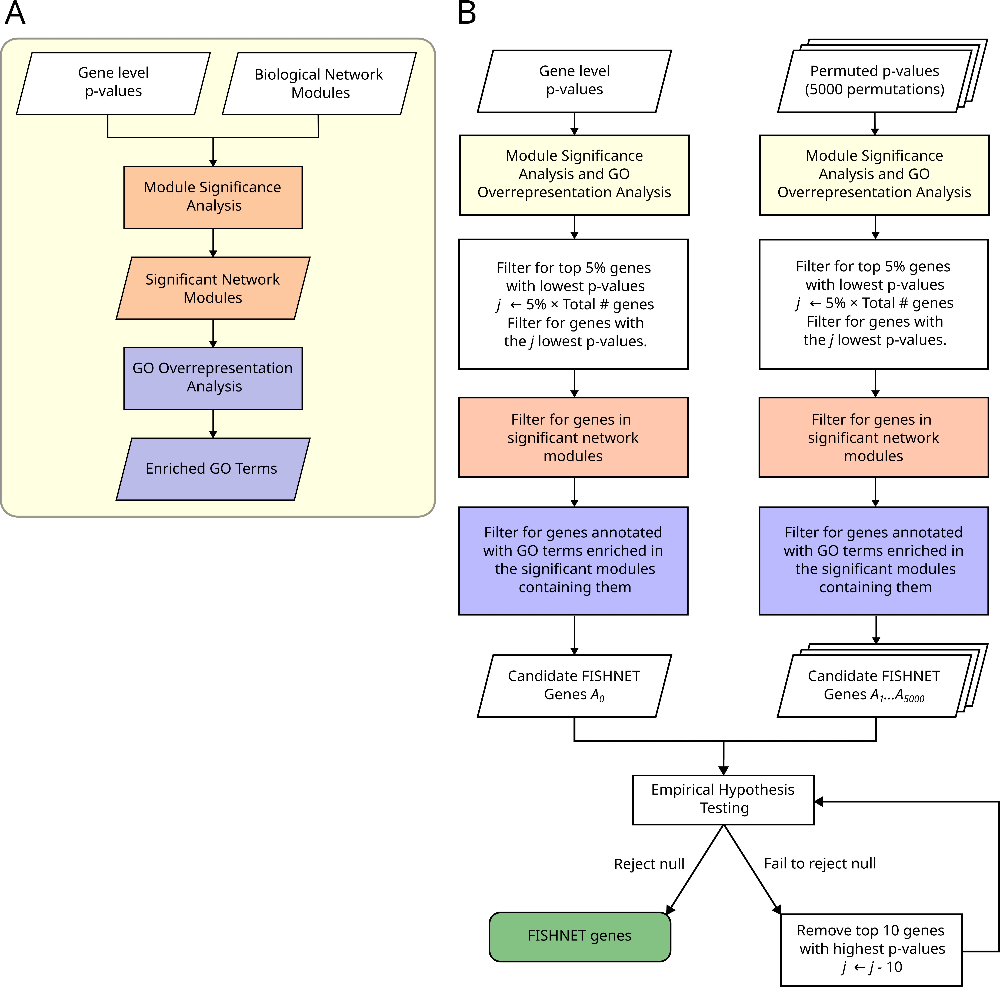

# FISHNET (Finding Significant Hits in NETworks)

FISHNET is a network-based tool that analyzes gene-level p-values to identify significant genes missed by standard methods, using prior biological knowledge to detect those that fail the genome-wide significance threshold but replicate nonetheless. FISHNET can use
gene-level summary statistics from GWAS, TWAS with measured or predicted gene
expression levels, proteome-wide association studies, RNA-Seq experiments, functional
genetics screens, or any other source. It uses gene-gene interactions in network modules from co-expression
networks, protein-protein interaction (PPI) networks, or other networks, together with
gene function annotations from Gene Ontology (GO). FISHNET manuscript is currently available in bioRxiv[^1]. The general workflow of FISHNET is shown in the figure below.

(A) The gene-level p-values are input into module significance analysis. Module
significance analysis outputs significant modules and their p-values. Gene ontology over-
representation analysis identifies biological processes with significant over-representation
among genes in each significant module. (B) The workflow illustrates the gene
prioritization mechanism used to identify FISHNET genes. 

----

[^1]: [Acharya et al. FISHNET: A Network-based Tool for Analyzing Gene-level P-values to Identify Significant Genes Missed by Standard Methods](https://doi.org/10.1101/2025.01.29.635546) 
